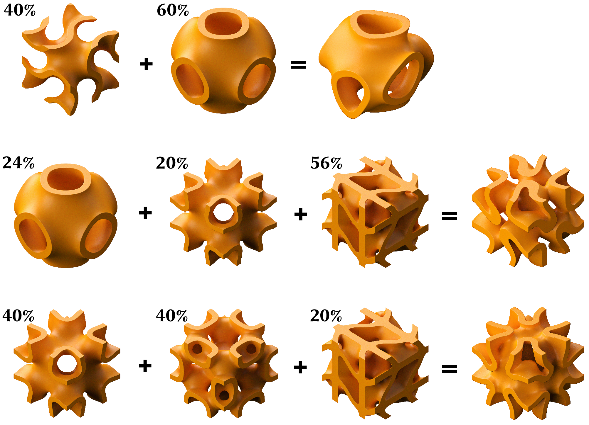

# <ins>TPM</ins>e<ins>S</ins>h

Triply Periodic Meshing for Triply Periodic Minimal Surfaces

## Building

#### Dependencies

```bash
pip install -r requirements.txt
```

* [numpy](https://numpy.org/) – for numerical operations
* [libigl](https://pypi.org/project/libigl/) – for mesh cleaning and processing
* [meshio](https://github.com/nschloe/meshio) – for reading and writing meshes
* [pygalmesh](https://github.com/zfergus/pygalmesh) – for mesh generation
* [polyscope](https://polyscope.run/) – for visualization
* [PyMCubes](https://github.com/pmneila/PyMCubes) – for surface mesh generation

> NOTE: We use a custom fork of `pygalmesh` ([zfergus/pygalmesh](https://github.com/zfergus/pygalmesh)). Install it with:
> ```
> pip install git+https://github.com/zfergus/pygalmesh.git
> ```
> rather than `pip install pygalmesh`.

#### Building C++ backend

We use a C++ backend to accelerate implicit function evaluations. To build it, you need to have a C++ compiler and CMake installed. Then run:

```bash
pip install -e .
```

This uses `nanobind` to create a `_tpms` module that provides the C++ functionality for evaluating TPMS implicit functions.

> NOTE: The `_tpms` module is included in the `TPMeSh` package, so you don't need to import it separately.

## Usage

```
$ python TPMeSh/mesh_tpms.py -h
usage: mesh_tpms.py [-h] [-x X X X X X X X X] [-i I] [-s] [-p] [-o OUTPUT] [-t THICKNESS]
                    [-n ELEMENTS_IN_THICKNESS] [-r REPEATS REPEATS REPEATS] [-v]

Generate a TPMS mesh with given design parameters.

options:
  -h, --help            show this help message and exit
  -x X X X X X X X X    design parameters
  -i I                  Generate a canonical TPMS with the given index
  -s, --surface         generate surface mesh
  -p, --periodic        generate periodic mesh
  -o, --output OUTPUT   output mesh name (.stl for surface mesh, .msh for volume mesh)
  -t, --thickness THICKNESS thickness of the TPMS mesh walls (default: 0.5)
  -n, --elements-in-thickness ELEMENTS_IN_THICKNESS
                        Number of elements in the thickness of the mesh (default: 2)
  -r, --repeats REPEATS REPEATS REPEATS
                        Number of repeats in each direction (default: 4 2 4 for full mesh,
                        1 1 1 for periodic mesh)
  -v, --visualize       visualize the mesh

```

### Primitives

To generate a mesh for a specific TPMS primitive, use the `-i` option with an integer index.

```bash
python -m TPMeSh.mesh_tpms -i <primitive_index>
```

where `<primitive_index>` is an integer from 0 to 7, corresponding to the following TPMS primitives:

<!-- 4x2 Tables of Images for TPMS primitives -->
| (1) Schoen Gyroid | (2) Schwarz Diamond | (3) Schwarz Primitive | (4) Schoen IWP |
| :---: | :---: | :---: | :---: |
|  |  |  |  |
| **(5) Neovius** | **(6) Fischer Koch S** | **(7) Schoen FRD** | **(8) PMY** |
|  |  |  |  |

### Volumetric Meshing

```bash
python -m TPMeSh.mesh_tpms -i 2 -r 2 2 2 -o "2.msh"
```


### Surface Meshing

```bash
python -m TPMeSh.mesh_tpms -i 2 -r 2 2 2 -s -o "2.stl"
```


### Periodic Meshing

```bash
python -m TPMeSh.mesh_tpms -i 2 -r 1 1 1 -p -o "2p.msh"
```


### Interpolation

To interpolate a TPMS surface mesh, you can use the `-x` option with the design parameters. For example:

```bash
python -m TPMeSh.mesh_tpms -x 0.4 0 0.6 0 0 0 0 0 -o "interpolation_a.msh"
python -m TPMeSh.mesh_tpms -x 0 0 0.24 0.2 0 0 0 0.56 -o "interpolation_b.msh"
python -m TPMeSh.mesh_tpms -x 0 0 0 0.4 0 0 0.4 0.2 -o "interpolation_c.msh"
```



## License

This project is licensed under the GPL v3.0 License - see the [LICENSE](LICENSE) file for details.
This is in compliance with the original CGAL/pygalmesh licenses, which are also GPL v3.0.