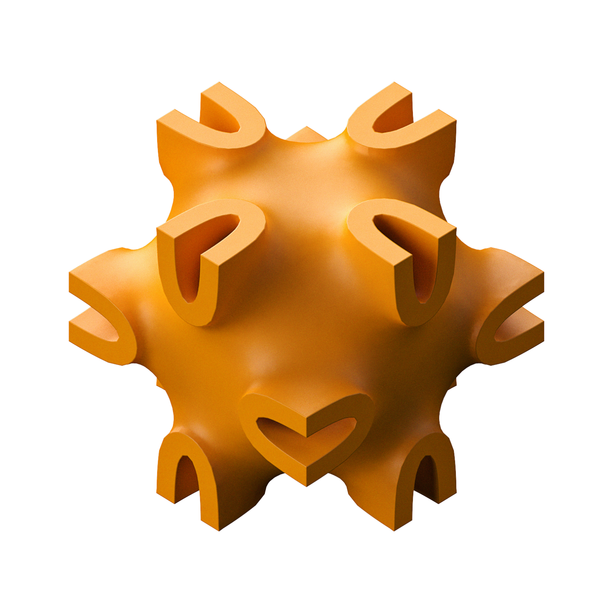
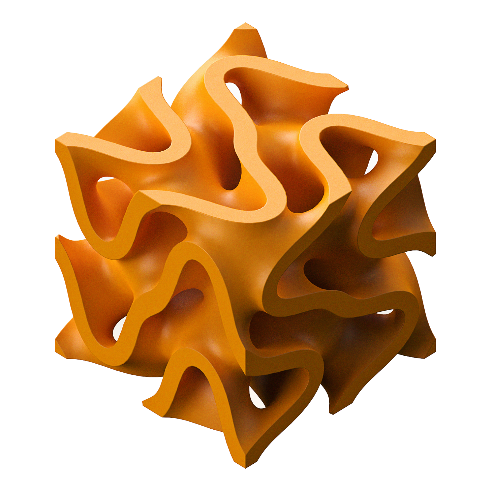
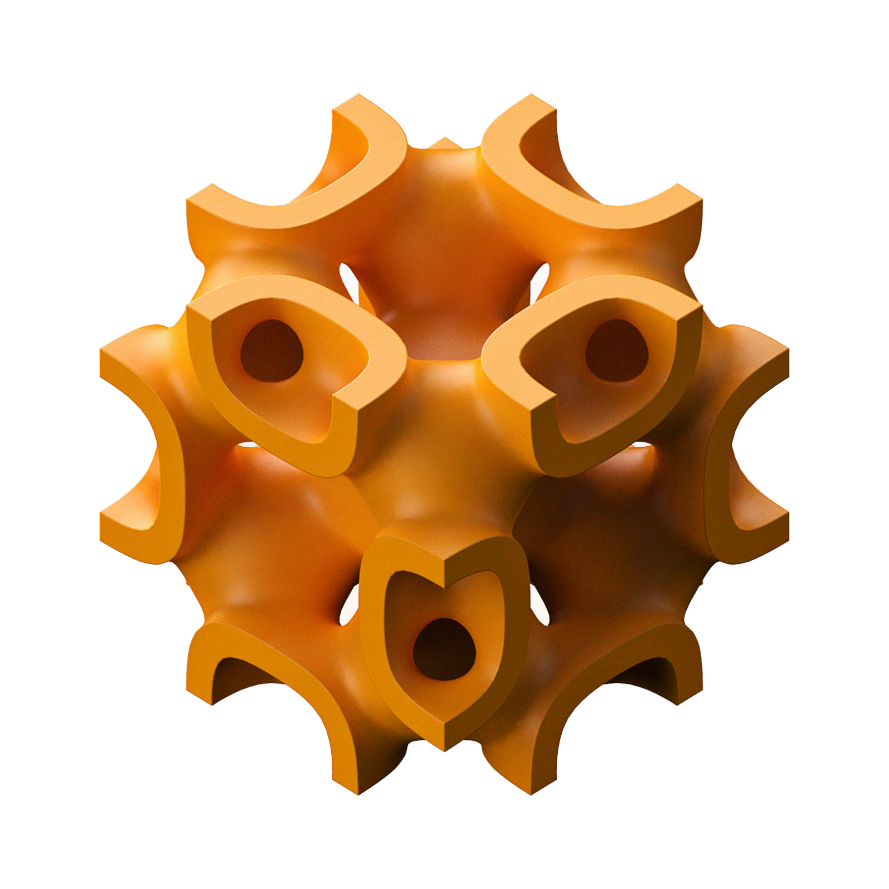

# <ins>TPM</ins>e<ins>S</ins>h – Examples

## Cylinder

Implicit representation of a cylinder with radius `r` aligned along the y-axis:

$$
f(x, y, z) = (x-r)^2 + (z-r)^2 - r^2.\\
$$

The partial derivatives are:

$$
\frac{\partial f}{\partial x} = 2(x-r)\quad\quad
\frac{\partial f}{\partial y} = 0\quad\quad
\frac{\partial f}{\partial z} = 2(z-r).
$$

```bash
python examples/cylinder.py
```


## Spatially Varying TPMS

Spatially interpolate between all eight TPMS primitives to create a spatially varying TPMS.

Using the Sigmoid function

$$
S(x) = \frac{1}{1 + e^{-x}}
$$

we define the spatially varying TPMS as:

$$
f(x, y, z) = \sum_{i=1}^8 S(m_i^{x} x) \cdot S(m^y_i y) \cdot S(m^z_i z) \cdot f_i(x, y, z),
$$

where $f_i$ are the eight TPMS primitives, and

$$
m_{\{1,2,3,4\}}^{x} = -1, \quad m_{\{5,6,7,8\}}^{x} = 1,\\
m_{\{1,2,5,6\}}^{y} = -1, \quad m_{\{2,3,7,8\}}^{y} = 1,\\
m_{\{1,3,5,7\}}^{z} = -1, \quad m_{\{2,4,6,8\}}^{z} = 1.
$$

```bash
python examples/spatially_varying_tpms.py
```


## Square Wave

We can create a square wave function using the gyroid TPMS. The square wave is defined as:

$$
f(x, y, z) = \sum_{k=1}^{N} \frac{\mathrm{gyroid}\left({(2k-1)}\cdot x, y, z\right)}{2k-1}
$$

where $N=4$ in this example.

```bash
python examples/square_wave.py
```


## Large Examples

Generate large tilings of TPMS.

```bash
python examples/large_examples.py
```

| a | b | c |
| :---: | :---: | :---: |
|  |  |  |

## Primitves

Generate high resolution surface meshes for the eight TPMS primitives.
```bash
./examples/primitives.sh
```

<!-- 4x2 Tables of Images for TPMS primitives -->
| (1) Schoen Gyroid | (2) Schwarz Diamond | (3) Schwarz Primitive | (4) Schoen IWP |
| :---: | :---: | :---: | :---: |
|  |  |  |  |
| **(5) Neovius** | **(6) Fischer Koch S** | **(7) Schoen FRD** | **(8) PMY** |
|  |  |  |  |

## Interesting Combinations

Generate interesting combinations of TPMS primitives.

```bash
python examples/interesting_combos.py
```

| `-x 0 0 0 0.4 0 0 0.4 0.2` | `-x 0 0 0.24 0.2 0 0 0 0.56` | `-x 0.4 0 0.6 0 0 0 0 0` |
| :---: | :---: | :---: |
|  |  |  |