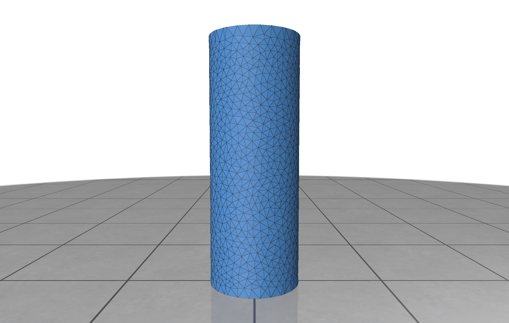
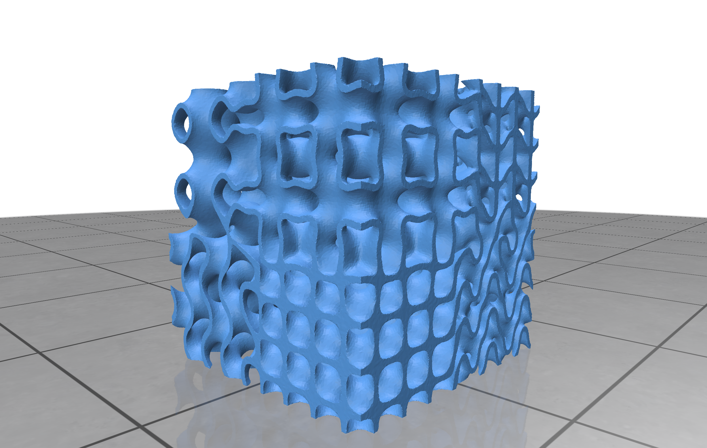

# <ins>TPM</ins>e<ins>S</ins>h – Examples

## Cylinder

Implicit representation of a cylinder with radius `r` aligned along the y-axis:

$$
f(x, y, z) = (x-r)^2 + (z-r)^2 - r^2.\\
$$

The partial derivatives are:

$$
\frac{\partial f}{\partial x} = 2(x-r)\quad\quad
\frac{\partial f}{\partial y} = 0\quad\quad
\frac{\partial f}{\partial z} = 2(z-r).
$$

```bash
python examples/cylinder.py
```



## Spatially Varying TPMS

Spatially interpolate between all eight TPMS primitives to create a spatially varying TPMS.

```bash
python examples/spatially_varying_tpms.py
```


